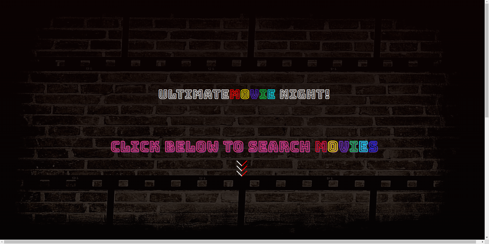
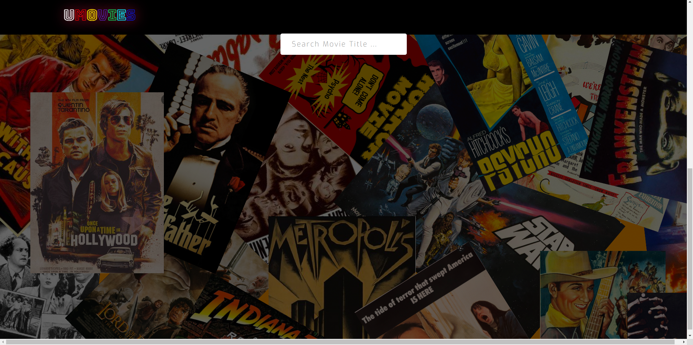
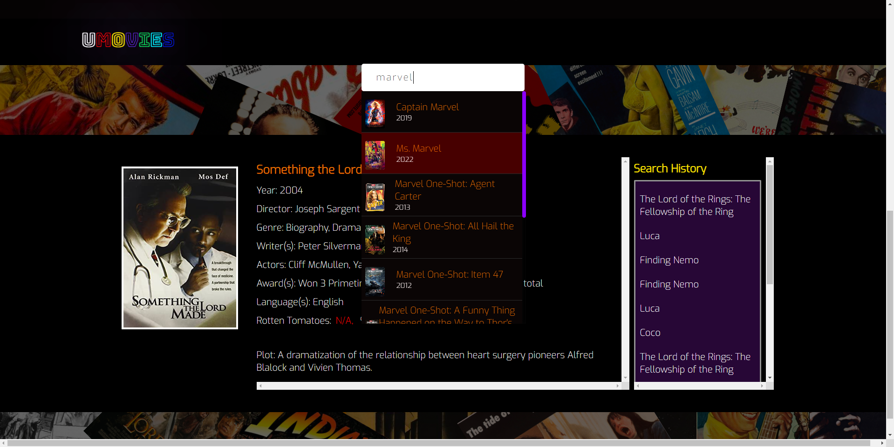
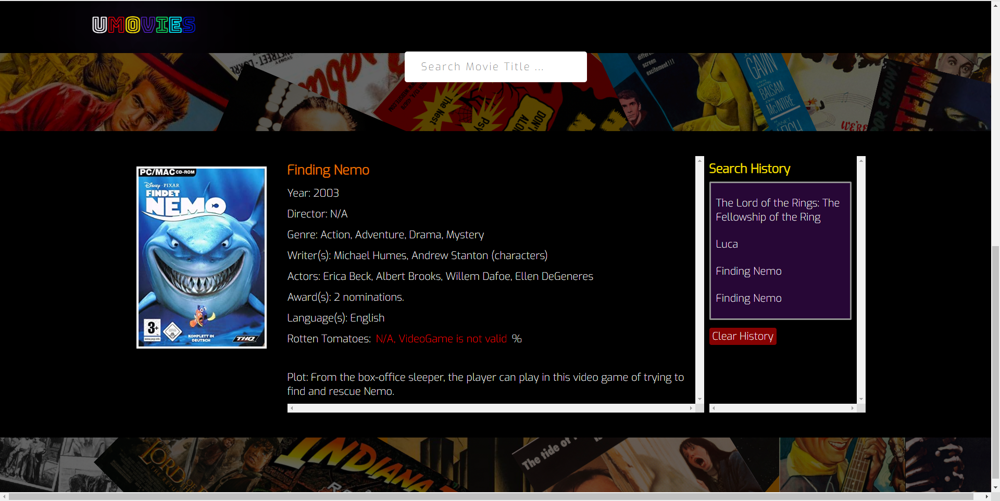
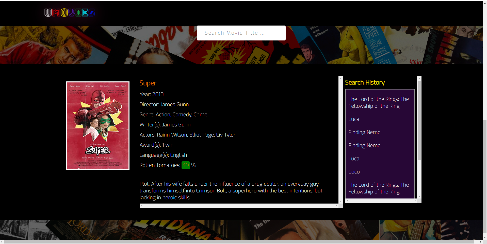

## Project Title: 

# Ultimate Movies


##  The URL of the Deployed Application:
```
  https://borthvader.github.io/crispy-memory/
```

## Project Description:

Our goal is to bring fast, reliable, and trouble-free open-source movies application. As a developer, our group creates a simple movie application that allows the user to select and save movies by rating. So, that user can watch top rating movies with no hustle. This app will run in the browser and feature dynamically updated HTML and CSS powered by jQuery.


## How to Run the Project:

When we go to the movie application it shows instructions to go to on to the next page by clicking the arrows or scrolling down either way. The next page shows a search bar that allows user to input their movie name and the moment user start typing the characters drop-down option start showing multiple movie options to choose from. The title for the searched movie is saved in local storage and when user refreshes the page it shows that local storage maintain the data for the searched movies. When user select a movie it gives detailed data about the movie which isincludes: Title of the movie, Movie Poster, Plot, Year, Director, Genre, Writer, Actors, Awards, Language, and Rating.

## API Reference:

#### 1. API for Movie Details

```
  https://omdbapi.com/
```
#### 2. API for Rotten Tomatoes Ratings
```
  https://imdb-api.com/
```

## Technologies:

HTML<br>
CSS <br>
JavaScript<br>
Axios


## Run Locally:

Clone the project

```
  On GitHub.com, navigate to the main page of the repository.
```

Open Git Bash.

```
  Copy the URL for the repository.
  git clone https://link-to-project
```

Type git clone, and then paste the URL copied earlier.
```
  bash
  $ git clone https://github.com/YOUR-USERNAME/YOUR-REPOSITORY
```

Press Enter to create your local clone.

```
  bash
  Press Enter to create your local clone.
```
## Screenshots:








## Demo:


# Links

Link for your review:

* The URL of the GitHub repository. 
https://github.com/asrabilal/crispy-memory.git


© 2022 Team work Solution Sevices, Inc.

## License

MIT License

Copyright (c) [2022]

Permission is hereby granted, free of charge, to any person obtaining a copy of this software and associated documentation files (the "Software"), to deal in the Software without restriction, including without limitation the rights to use, copy, modify, merge, publish, distribute, sublicense, and/or sell copies of the Software, and to permit persons to whom the Software is furnished to do so, subject to the following conditions:

The above copyright notice and this permission notice shall be included in all copies or substantial portions of the Software.

THE SOFTWARE IS PROVIDED "AS IS", WITHOUT WARRANTY OF ANY KIND, EXPRESS OR IMPLIED, INCLUDING BUT NOT LIMITED TO THE WARRANTIES OF MERCHANTABILITY, FITNESS FOR A PARTICULAR PURPOSE AND NONINFRINGEMENT. IN NO EVENT SHALL THE AUTHORS OR COPYRIGHT HOLDERS BE LIABLE FOR ANY CLAIM, DAMAGES OR OTHER LIABILITY, WHETHER IN AN ACTION OF CONTRACT, TORT OR OTHERWISE, ARISING FROM, OUT OF OR IN CONNECTION WITH THE SOFTWARE OR THE USE OR OTHER DEALINGS IN THE SOFTWARE.
